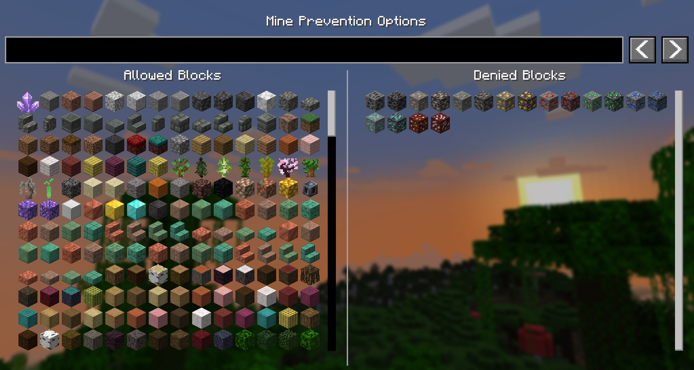
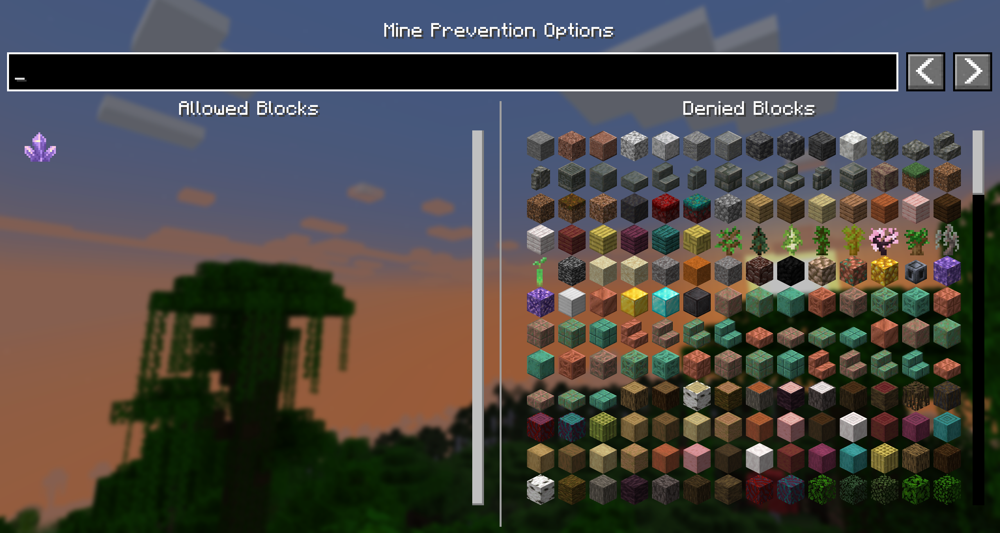

# Mine Prevention

This is a simple client-side mod that gives you the ability to avoid mining certain blocks. 

For example, block all ores while you're mining without Silktouch or Fortune so you can save them for later! Or perhaps only allow yourself to mine large amethyst buds so that you don't accidentally break the budding block!

## Usage
Simply press 'M' to open the GUI and select the blocks you want to block or allow. The keybind can be changed in the controls menu, and you can also choose to remove it in favour of ModMenu.

The config file for this mod is located in the `config` folder of your Minecraft directory, and is called `mineprevention.json`. It only contains a deny list, to minimise the amount of data stored.

## Images

## Contributing
Contributions and suggestions are always welcome! Please limit all issues to only one feature at a time - feel free to open multiple at once if you have many ideas. Similarly, please limit pull requests to a single feature at a time and try to follow the existing code style.

To further discuss or get notifications of new updates, check out my [Discord](https://discord.gg/gyTa5v7kKk). If you like what I do, consider supporting me on Ko-Fi! 
